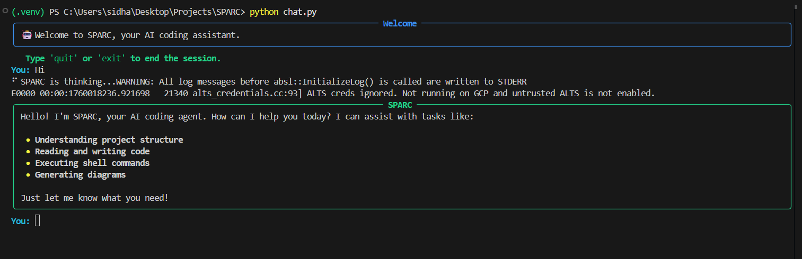
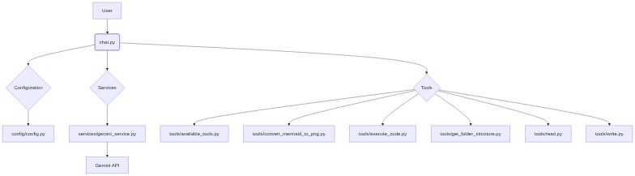

# S.P.A.R.C.: Syntax & Programmatic Assistance Resource Component.

## Overview

SPARC (Syntax & Programmatic Assistance Resource Component) is a command-line chat application that acts as an AI coding assistant. It leverages the power of Google's Gemini Pro model to understand and respond to your coding-related queries. SPARC can interact with your file system, read and write files, execute code, and even generate diagrams to provide a seamless and efficient development experience.

## Features

- **Conversational AI:** Chat with a powerful AI to get help with your coding tasks.
- **File System Interaction:** SPARC can read your project structure, and read and write to files.
- **Code Execution:** SPARC can execute code to verify solutions and ensure correctness.
- **Diagram Generation:** SPARC can generate diagrams from Mermaid syntax to visualize code and architecture.
- **Extensible Toolset:** The toolset can be easily extended to add more functionalities.
- 
## UI



## Getting Started

### Prerequisites

- Python 3.7+
- An active Google AI Studio API key.

### Installation

1. **Clone the repository:**
   ```bash
   git clone https://github.com/sidharth-e/SPARC.git
   cd SPARC
   ```

2. **Create a virtual environment:**
   ```bash
   python -m venv .venv
   source .venv/bin/activate  # On Windows, use `.venv\Scripts\activate`
   ```

3. **Install the dependencies:**
   ```bash
   pip install -r requirements.txt
   ```

4. **Set up your environment variables:**
   - Create a `.env` file in the project root.
   - Add your Google AI Studio API key to the `.env` file:
     ```
     GOOGLE_API_KEY="your-api-key"
     ```

## Usage

To start the chat application, run the following command:

```bash
python chat.py
```

You can then start interacting with SPARC. Type `quit` or `exit` to end the session.

## Tools

SPARC is equipped with the following tools:

- **`get_folder_structure`**: Displays the folder structure of your project.
- **`read_file_content`**: Reads the content of a specified file.
- **`write_to_file`**: Writes content to a specified file.
- **`execute_code`**: Executes a given code snippet.
- **`convert_mermaid_to_png`**: Converts a string of Mermaid code to a PNG image.

## Project Structure

```
├── .gitignore
├── chat.py
├── README.md
├── requirements.txt
├── config
│   └── config.py
├── services
│   └── gemini_service.py
└── tools
    ├── available_tools.py
    ├── convert_mermaid_to_png.py
    ├── execute_code.py
    ├── get_folder_structure.py
    ├── read.py
    └── write.py
```

- **`chat.py`**: The main entry point for the command-line chat application.
- **`config/config.py`**: Contains the core configuration, including the AI's name, the Gemini model name, and the system prompt.
- **`services/gemini_service.py`**: A service that initializes the Gemini model with the system prompt, API key, and a registry of available tools.
- **`tools/`**: This directory contains the tools that the AI can use.

## Architecture
